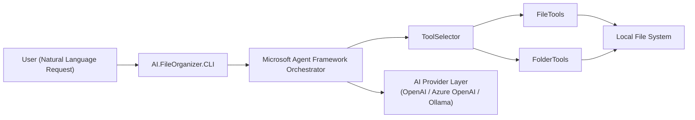

# AI.FileOrganizer

AI.FileOrganizer is an AI-powered command-line tool that helps you organize files and folders using natural language instructions.

It is built with the [Microsoft Agent Framework](https://learn.microsoft.com/en-us/agent-framework/overview/) and uses pluggable AI providers to interpret intent, select the right tools, and safely execute file operations.

## What It Does

- Accepts natural language requests from a CLI.
- Uses an AI agent to classify intent and choose appropriate tools.
- Performs file and folder operations through focused tool modules.
- Supports multiple AI backends through a provider abstraction layer.

## High-Level Architecture



## Projects

- `AI.FileOrganizer`: Core library containing intent handling and tool selection.
- `AI.FileOrganizer.CLI`: Command-line host that runs the agent workflow.

## Download and Run (Prebuilt Binaries)

Prebuilt binaries are published for each tagged release in GitHub Releases:

- `AI.FileOrganizer-win-x64.zip`
- `AI.FileOrganizer-linux-x64.zip`
- `AI.FileOrganizer-osx-arm64.zip`

Download from: [Releases](https://github.com/jihadkhawaja/AI.FileOrganizer/releases)

### 1. Extract the archive

Extract the archive for your platform into any folder.

### 2. Configure provider settings

Open `config.yaml` in the extracted folder and set the provider you want to use.

Example:

```yaml
OpenAI:
  ApiKey: "your-api-key"
  Model: "gpt-4o-mini"
```

### 3. Run the CLI

Windows (`win-x64`):

```powershell
.\AI.FileOrganizer.CLI.exe
```

Linux (`linux-x64`):

```bash
chmod +x ./AI.FileOrganizer.CLI
./AI.FileOrganizer.CLI
```

macOS Apple Silicon (`osx-arm64`):

```bash
chmod +x ./AI.FileOrganizer.CLI
./AI.FileOrganizer.CLI
```

The app will prompt you to choose a provider and then accept natural-language file organization requests.

## Recurring Schedules

The recommended scheduling model is to run the CLI once per job and let the operating system handle recurrence.

Why this design:

- The current app is a console host, not a Windows service.
- OS schedulers are more reliable for restarts, missed runs, and machine reboots.
- Each run stays deterministic: load config, execute one prompt, exit.

Add one or more jobs to `config.yaml`:

```yaml
Jobs:
  - Name: "downloads-cleanup"
    Prompt: "Organize files in Downloads by type"
    Provider: "OpenAI"
    AutoApprove: true
    PersistMemory: false
    ThinkingLevel: "low"
    Schedule: "Daily at midnight"
    Enabled: true
```

Generate a sample job block:

```powershell
dotnet run --project AI.FileOrganizer.CLI/AI.FileOrganizer.CLI.csproj -- --job-template downloads-cleanup
```

Create a job interactively and write it into `config.yaml`:

```powershell
dotnet run --project AI.FileOrganizer.CLI/AI.FileOrganizer.CLI.csproj -- --create-job
```

Run a job once:

```powershell
dotnet run --project AI.FileOrganizer.CLI/AI.FileOrganizer.CLI.csproj -- --job downloads-cleanup
```

List configured jobs:

```powershell
dotnet run --project AI.FileOrganizer.CLI/AI.FileOrganizer.CLI.csproj -- --list-jobs
```

Print the Windows Task Scheduler action for a job:

```powershell
dotnet run --project AI.FileOrganizer.CLI/AI.FileOrganizer.CLI.csproj -- --task-command downloads-cleanup
```

You can also use the wrapper scripts instead of the full `dotnet run` command.

PowerShell:

```powershell
./scripts/ai-fileorganizer.ps1 create-job
./scripts/ai-fileorganizer.ps1 list-jobs
./scripts/ai-fileorganizer.ps1 job-template downloads-cleanup
./scripts/ai-fileorganizer.ps1 run-job downloads-cleanup
./scripts/ai-fileorganizer.ps1 task-command downloads-cleanup
```

Linux/macOS:

```bash
chmod +x ./scripts/ai-fileorganizer.sh
./scripts/ai-fileorganizer.sh create-job
./scripts/ai-fileorganizer.sh list-jobs
./scripts/ai-fileorganizer.sh job-template downloads-cleanup
./scripts/ai-fileorganizer.sh run-job downloads-cleanup
./scripts/ai-fileorganizer.sh task-command downloads-cleanup
```

For unattended execution, set `AutoApprove: true`. If a job triggers an approval-gated tool and `AutoApprove` is `false`, the run will fail instead of hanging.

### Windows Task Scheduler

Create a task that runs the CLI on your preferred cadence. Example action:

```powershell
dotnet run --project "C:\path\to\AI.FileOrganizer.CLI\AI.FileOrganizer.CLI.csproj" -- --job downloads-cleanup
```

If you publish the app first, point Task Scheduler to the published executable instead of `dotnet run`.

## Build from Source

```powershell
dotnet build AI.FileOrganizer.slnx
dotnet run --project AI.FileOrganizer.CLI/AI.FileOrganizer.CLI.csproj
```

## License

This project is licensed under the [MIT License](LICENSE.txt).

---

*Powered by [Microsoft Agent Framework](https://learn.microsoft.com/en-us/agent-framework/overview/).*