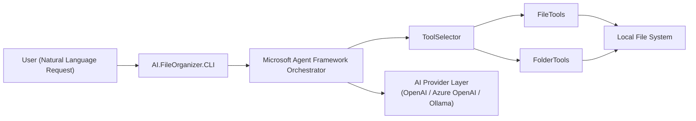

# AI.FileOrganizer

AI.FileOrganizer is an AI-powered command-line tool that helps you organize files and folders using natural language instructions.

It is built with the [Microsoft Agent Framework](https://learn.microsoft.com/en-us/agent-framework/overview/) and uses pluggable AI providers to interpret intent, select the right tools, and safely execute file operations.

## What It Does

- Accepts natural language requests from a CLI.
- Uses an AI agent to classify intent and choose appropriate tools.
- Performs file and folder operations through focused tool modules.
- Supports multiple AI backends through a provider abstraction layer.

## High-Level Architecture



## Projects

- `AI.FileOrganizer`: Core library containing intent handling and tool selection.
- `AI.FileOrganizer.CLI`: Command-line host that runs the agent workflow.

## Download and Run (Prebuilt Binaries)

Prebuilt binaries are published for each tagged release in GitHub Releases:

- `AI.FileOrganizer-win-x64.zip`
- `AI.FileOrganizer-linux-x64.zip`
- `AI.FileOrganizer-osx-arm64.zip`

Download from: [Releases](https://github.com/jihadkhawaja/AI.FileOrganizer/releases)

### 1. Extract the archive

Extract the archive for your platform into any folder.

### 2. Configure provider settings

Open `config.yaml` in the extracted folder and set the provider you want to use.

Example:

```yaml
OpenAI:
  ApiKey: "your-api-key"
  Model: "gpt-4o-mini"
```

### 3. Run the CLI

Windows (`win-x64`):

```powershell
.\AI.FileOrganizer.CLI.exe
```

Linux (`linux-x64`):

```bash
chmod +x ./AI.FileOrganizer.CLI
./AI.FileOrganizer.CLI
```

macOS Apple Silicon (`osx-arm64`):

```bash
chmod +x ./AI.FileOrganizer.CLI
./AI.FileOrganizer.CLI
```

The app will prompt you to choose a provider and then accept natural-language file organization requests.

## Build from Source

```powershell
dotnet build AI.FileOrganizer.slnx
dotnet run --project AI.FileOrganizer.CLI/AI.FileOrganizer.CLI.csproj
```

## License

This project is licensed under the [MIT License](LICENSE.txt).

---

*Powered by [Microsoft Agent Framework](https://learn.microsoft.com/en-us/agent-framework/overview/).*